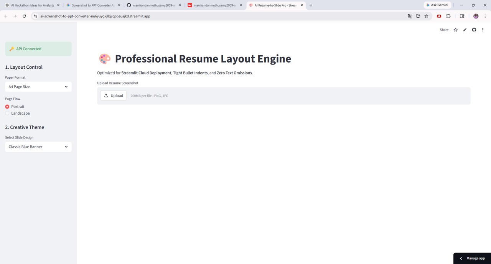
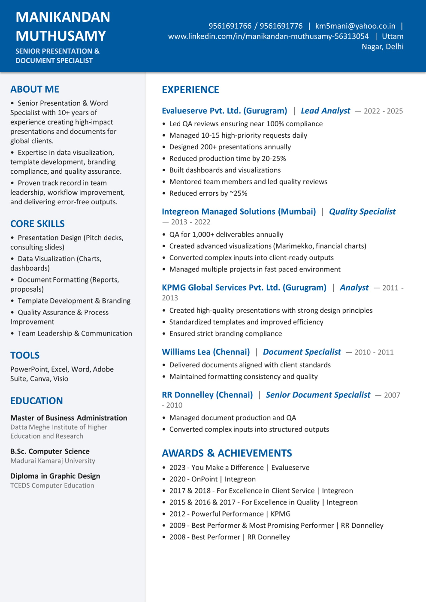

# AI Screenshot to PPT Converter

AI-powered Streamlit application that converts screenshots into editable PowerPoint presentations using Gemini AI and intelligent layout reconstruction.

---

## 🚀 Live Demo

🔗 Streamlit App:  
[https://your-streamlit-url.streamlit.app](https://ai-screenshot-to-ppt-converter-nu6yuygkjlbjsqcqeuajkd.streamlit.app/)

---

## 📸 App Preview

### Streamlit Application


---

### Sample Input Screenshot


---

### Generated PowerPoint Output


---

## 🚀 Features

- Screenshot to editable PowerPoint conversion
- Gemini AI powered OCR and layout understanding
- Creative resume slide generation
- Multiple presentation themes
- Editable PPTX output
- Automatic layout balancing
- Streamlit web application
- A4 / Portrait / Landscape support
- Intelligent section alignment
- AI-powered content extraction

---

## 🛠️ Tech Stack

- Python
- Streamlit
- Gemini AI API
- python-pptx
- Pillow
- OpenCV

---

## 🔑 Gemini API Setup

This project uses Google's Gemini AI API for OCR analysis and intelligent PowerPoint layout generation.

### Step 1 — Create Gemini API Key

Visit:

https://aistudio.google.com/app/apikey

Generate your own Gemini API key.

---

### Step 2 — Set API Key Locally

For Windows PowerShell:

```powershell
$env:GEMINI_API_KEY="YOUR_API_KEY"
```

---

### Step 3 — Run Streamlit App

```bash
streamlit run app.py
```

---

## ☁️ Streamlit Cloud Deployment

In Streamlit Cloud:

1. Open App Settings
2. Go to Secrets
3. Add:

```toml
GEMINI_API_KEY="YOUR_API_KEY"
```

Do NOT upload secrets.toml publicly to GitHub.

---

## 📂 Project Structure

```text
ai-screenshot-to-ppt-converter/
│
├── app.py
├── requirements.txt
├── runtime.txt
├── README.md
├── LICENSE
└── images/
    ├── app-demo.jpg
    ├── sample-input.jpg
    └── output-slide.jpg
```

---

## 📌 Example Workflow

1. Upload resume screenshot
2. Gemini AI extracts layout and text
3. App reconstructs professional slide layout
4. Editable PowerPoint generated automatically
5. Download PPTX file

---

## 📜 License

MIT License

---

## 👨‍💻 Author

Manikandan Muthusamy

LinkedIn:  
https://www.linkedin.com/in/manikandan-muthusamy-56313054

---

## ⭐ Support

If you like this project, consider giving it a ⭐ on GitHub.
